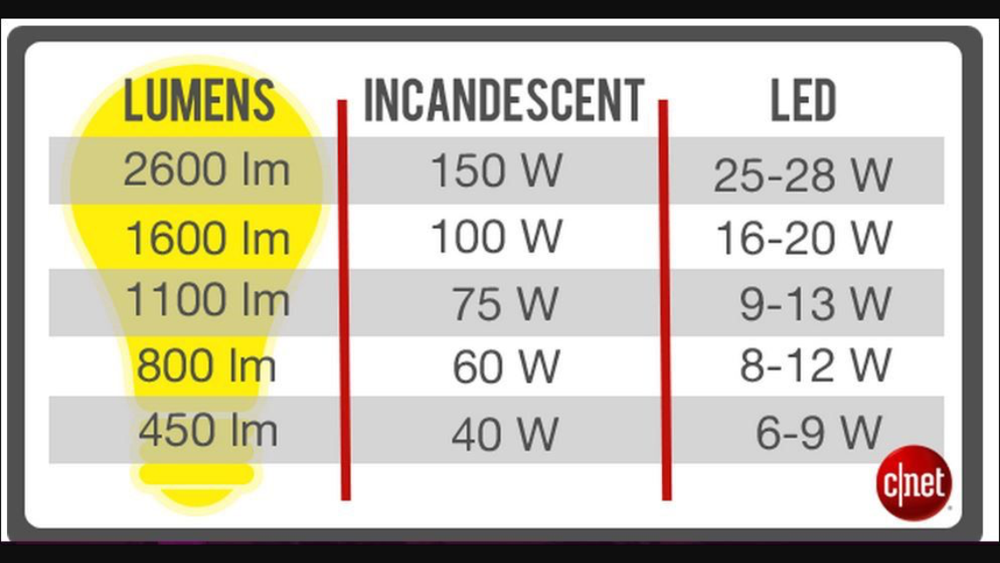

```{r setup, include=FALSE}
knitr::opts_chunk$set(echo = TRUE)
```
# {.tabset .tabset-pills}

## Background

### What is LED?

[Light-emitting diode (LED) is a widely used standard source of light in electrical equipment. They are mostly found in applications within devices that show the time and display different types of data. The colour of an LED is determined by the material used in the semiconducting element.](https://byjus.com/physics/light-emitting-diode/) 
A light-emitting diode (LED) is a semiconductor device that emits light when an electric current flows through it

### What is Lumen?

The definition of lumen is: “a unit of luminous flux in the International System of Units, that is equal to the amount of light given out through a solid angle by a source of one candela intensity radiating equally in all directions.”  

[In short, lumens equal brightness. And watts do not. Not that watts are bad, but they measure energy use, not light output. With new, energy-efficient LED technology, we can no longer rely upon wattage to indicate how bright a bulb is. See how to measure lumens below:](https://www.lumens.com/the-edit/the-guides/light-bulb-facts-the-meaning-of-lumens/?clickid=Wcb1IpTmPxyPWCty-6Ww21zPUkH2baQfFQts3k0&utm_medium=affiliate&utm_source=ir&irgwc=1&im_rewards=1)  




## Task 1

```{r}
library(data4led)
library(pander)
```

This data table below is a representation of the Data set. It gives each of the values in an orderly fashion. Each of the columns represent pertinent data. The only data however that we will use in this analysis is comparing the percent_intensity to the hours column.

```{r}
bulb <- led_bulb(1, seed = 719)
pander(head(bulb))
```

In the graph we can see that there is an upward trend that as the hours of use increase so does the intensity of the light bulb. There are the outliers, in the data frame. However, there is a trend that seems to begin to level off at about hour 2000. From hour 2000 on the climb seems to not be as steep. This looks like a quadratic model may be the best fit.

```{r}
plot(bulb$hours, bulb$percent_intensity, main = "Correlation between Bulb Hours and Intensity (%)", xlab = "Hours", ylab = "Intensity(%)")
```


